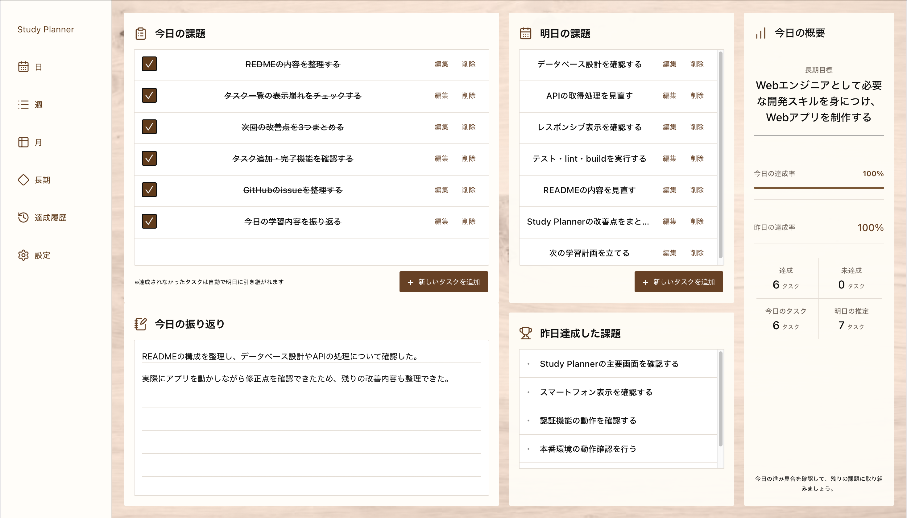
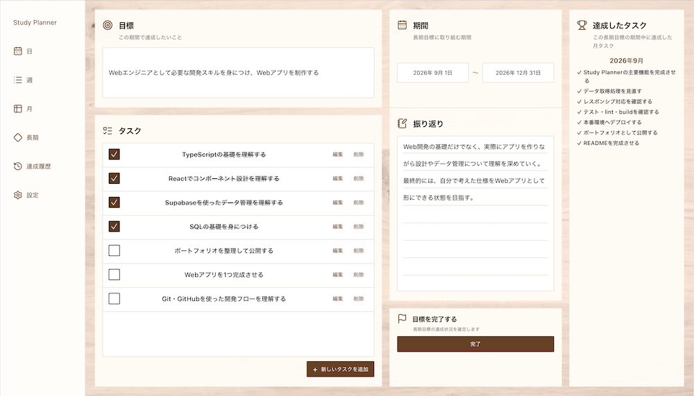
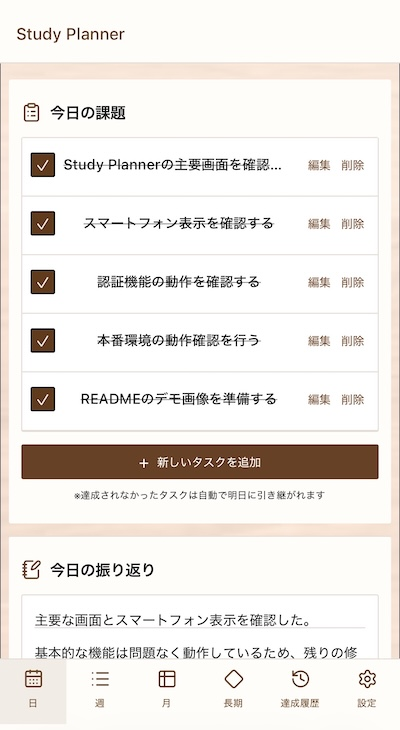
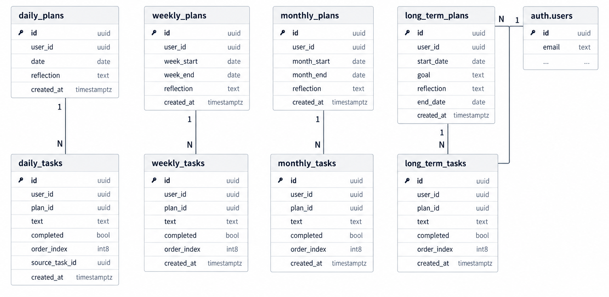

# Study Planner

日・週・月・長期の学習計画とタスクを一元管理できるWebアプリです。

React + TypeScript + Supabaseで開発し、
認証・データ管理・テスト・本番環境へのデプロイまで個人で行っています。

[本番環境](https://study-planner-mu-eight.vercel.app/)

## デモ

### PC版

**Daily - 日々の学習タスク管理**

**Long-term - 長期目標とタスク管理**

### スマートフォン版

## 開発背景・目的

学習を続ける中で、あらかじめ目標やその日に取り組むことが決まっているときと、何をするか決まっていないときでは、学習の集中度に大きな違いがあると感じました。

そこで、長期的な目標を起点として、日・週・月などの期間ごとに取り組むべきことをあらかじめ整理し、次に何をするか迷わず学習に取り組めるようにしたいと考えました。

その考えをもとに、学習目標から日々のタスクまでを一つのアプリで管理でき、学習後の振り返りや達成状況も確認できる「Study Planner」を開発しました。

## 主な機能

- 長期目標・日・週・月ごとの学習計画管理
- タスクの追加・編集・削除・完了管理
- 学習内容の振り返り記録
- 完了したタスク・達成履歴の確認
- メールアドレス・GitHub・Googleによる認証
- ユーザーごとのデータ管理
- PC・スマートフォンに対応したレスポンシブUI
- アカウント管理・退会

## 使用技術

- TypeScript
- React
- Vite
- Supabase（認証・データベース）
- PostgreSQL（データベース）
- React Router（ページ遷移）
- dnd-kit（ドラッグ＆ドロップ）
- Vitest（テスト）

## 認証・データ管理

Study PlannerではSupabase Authenticationを利用してユーザー認証を実装しています。

メールアドレス・パスワードによる認証に加えて、GitHubおよびGoogle OAuthによるログインにも対応しています。

また、ユーザーごとに学習計画やタスクを管理し、
Row Level Security（RLS）を設定することで、
認証されたユーザーが自身のデータを扱える構成としています。

## データベース設計

Supabase（PostgreSQL）を使用し、
各期間の「plan」と「task」を分けて管理しています。

各データにはユーザーIDを持たせ、
認証ユーザーごとに自身の学習データを扱える構成としています。

## 品質管理・テスト

実装後の動作確認だけでなく、Vitestによるテスト、ESLintによるコードチェック、TypeScriptの型チェックを含むbuild確認を行っています。

最終確認時点では102件のテストがすべて成功し、ESLintでもエラー・警告がないことを確認した上で本番環境へデプロイしています。

また、開発中に発生した不具合については、原因を確認した上で修正し、ローカル環境だけでなく本番環境でも動作確認を行っています。

## UI・CSS設計

4px単位の余白や文字サイズ・色・ボタンなどの共通デザイントークンを定義し、Daily・Weekly・Monthlyなど各ページで同じ役割のUIを統一しています。

また、ページごとに個別のスタイルを増やすのではなく、共通のデザインルールを基準としながら、各ページの役割に応じてレイアウトを調整しています。

PC・スマートフォンの両方で利用できるよう、画面幅に応じてレイアウトを切り替えるレスポンシブ設計としています。

## Git・開発フロー

GitHubでIssueを作成し、改善内容を整理しながら開発を進めました。

通信処理の改善に伴うAPIの整理やCSS設計についてIssueを作成し、作業内容を明確にした上で実装・修正を行っています。

また、Pull Requestの作成からmainブランチへの反映まで実際に経験しました。

## デプロイ・本番環境

GitHubとVercelを連携し、mainブランチへの変更を本番環境へ自動デプロイする構成としています。

ローカル環境と本番環境で必要な環境変数を管理し、SupabaseのAuthenticationおよびOAuthについても本番環境で利用できるよう設定しています。

## 開発で工夫した点

### 学習計画が崩れても継続できるタスク管理

学習計画では、予定通りにタスクを消化できないことがあります。

そこで、Dailyで未達成となったタスクを翌日に繰り越せる仕組みを設計しました。

単純にタスクを完了・未完了で管理するだけではなく、予定通りに進まなかった場合でも、次の日の学習計画に自然につなげられるようにすることで、継続して利用しやすい設計を意識しました。

### 期間をまたいだ達成状況の可視化

Dailyで完了したタスクだけでなく、Weekly・Monthly・Long-termの各ページから、それぞれの期間内で達成した下位期間のタスクを確認できるようにしました。

長期的な目標だけを管理するのではなく、日々の達成が週・月・長期の計画にどうつながっているかを確認できるようにすることで、学習の進捗を一つの流れとして把握できるようにしています。

## 今後の改善

実際に使用してみて、機能の追加よりも「操作の手間を減らすこと」を重視した改善を行いたいと考えています。

### タスク操作の簡略化

現在はタスクの確認や追加のために画面を開いたり、入力操作を行ったりする必要があります。

今後は、作業中でも画面の邪魔にならない小さなUIに現在のタスクを1件だけ表示し、

1. 現在のタスクを確認
2. 完了したらその場でチェック
3. 完了したタスクを非表示
4. 次のタスクを表示
5. 必要に応じてその場で次のタスクを追加

というサイクルを、画面遷移せずに完結できるようにしたいと考えています。

また、タスクの入力自体についても、できるだけ入力の手間を減らせるよう改善する予定です。

### 計画機能の見直し

実際に使用した結果、計画を細かく立てることよりも、
日々のタスクを確認・実行する際の操作や思考の負担を減らすことが重要だと考えました。

そのため、今後はDailyとLong-termを中心に、
よりシンプルに学習を継続できる構成への見直しも検討しています。

今後は「機能を増やすこと」よりも、
実際の使用時にどれだけ操作や思考の負担を減らせるかを重視して改善していきます。
